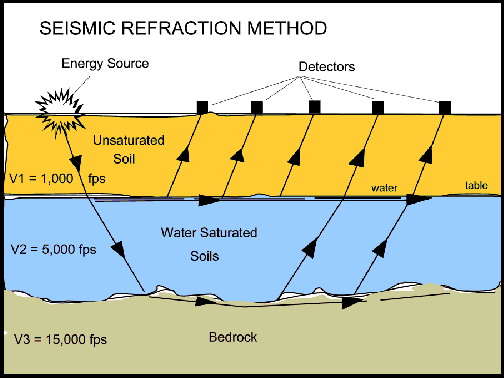
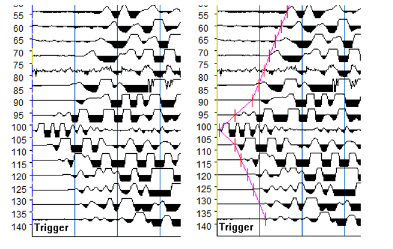
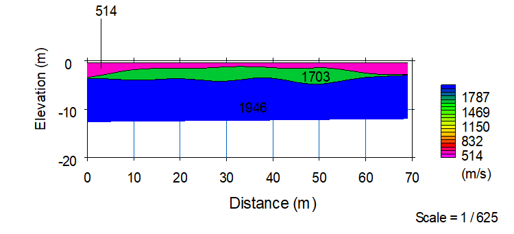

# Insitu Test

## SPT

E = 1 to 1.5 N for residual soil

su ~= 5N

Stroud (1974, 1989) recommended that E be estimated as 

Su = (4.5 - 5.5) N 

Eu = 50 to 1,500 Cu ; use 200 for typical soil

### Consistency of Fine Grained Soils

| Consistency      | Field guide to consistency                                   | Indicative undrained shear   strength    (kPa) |
| ---------------- | ------------------------------------------------------------ | ---------------------------------------------- |
| Very Soft (VS)   | Exudes between the fingers when squeezed in   hand           | Cu <   12                                      |
| Soft (S)         | Can be moulded by light finger pressure                      | 12 < Cu <   25                                 |
| Firm (F)         | Can be moulded by strong finger pressure                     | 25 < Cu < 50                                   |
| Stiff (St)       | Cannot be moulded by fingers                                 | 50 < Cu < 100                                  |
| Very Stiff (VSt) | Can be indented by thumb nail                                | 50 < Cu < 100                                  |
| Hard (H)         | Can be indented with difficulty by thumb nail                | Cu >   200                                     |
| Friable (Fr)     | Can be easily crumbled or broken into small   pieces by hand | -                                              |

### Consistency of Coarse Grained Soils

| Consistency      | Field guide to consistency                                   | Indicative undrained shear   strength    (kPa) |
| ---------------- | ------------------------------------------------------------ | ---------------------------------------------- |
| Very Soft (VS)   | Exudes between the fingers when squeezed in   hand           | Cu <   12                                      |
| Soft (S)         | Can be moulded by light finger pressure                      | 12 < Cu <   25                                 |
| Firm (F)         | Can be moulded by strong finger pressure                     | 25 < Cu < 50                                   |
| Stiff (St)       | Cannot be moulded by fingers                                 | 50 < Cu < 100                                  |
| Very Stiff (VSt) | Can be indented by thumb nail                                | 100 < Cu < 200                                 |
| Hard (H)         | Can be indented with difficulty by thumb nail                | Cu >   200                                     |
| Friable (Fr)     | Can be easily crumbled or broken into small   pieces by hand | -                                              |

## Shear Vane

Probedrill uses the GeoMil FFL 100 Vane Shear which comes with three rectangular vane types.  These are:

* 70mm * 35mm;
* 100mm * 50mm; and
* 150mm * 75mm vanes.

The test starts by pushing the vane and the rod vertically into the soft soil. 
The vane is then rotated at a speed which can be adjusted from 0.1°  per second up to 15 $^{\circ}$ per second, while the sampling rate can be user defined.

Upon completion of the undrained shear test, the user can easily start a remould test. The vane will be turned 5 revolutions at a speed of 15 $^{\circ}$ per second. 
To prevent damage the maximum torsion during remould is limited to 50%. After the 5 revolutions the system returns to the preset turning speed and will log
 the residual shear strength.

## CPT

## Seismic Refraction

The **Seismic Refraction method** is a type of **geophysical** soil exploration methods is based on the principle that elastic shock waves travel at different velocities in different materials. It does this by measuring the travel times of P-waves which are created by striking the ground with a large hammer. The P-waves travel through the subgrade and refract back to surface geophones when they encounter a material with a greater seismic velocity. A Geode multi-channel data logger is employed to collect the vibration traces from 24 equally spaced geophones, and this time-distance information is uploaded to a computer. The depth of detection is limited by the length of the traverse and the energy of the wave source (or shot). In this case, using a sledge hammer as the energy source and a traverse length of 69 m, a depth of up to 25 m can be investigated. A higher energy source (such as a truck mounted hammer or explosives) and longer traverse length would be required to investigate to greater depth..

**Table:** Survey setup

| Geophone spacing      | 3 m       | 4 m  | 5 m       | 6 m       |
| --------------------- | --------- | ---- | --------- | --------- |
| Survey length         | 69 m      | 92 m | 115 m     | 138 m     |
| Depth of interest     | 15 – 18 m | 20 m | 25 – 30 m | 30 – 35 m |
| Equipment setup point | 34.5 m    | 46 m | 58.5 m    | 69 m      |

The shear wave velocity is calculated from the P-wave velocity and subsequently the shear moduli of subsurface materials are calculated from the shear wave velocity. Interpretation of the survey traverses is presented in Figure

