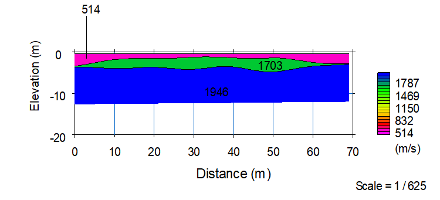

## Seismic Refraction

The **Seismic Refraction method** is a type of **geophysical** soil exploration methods is based on the principle that elastic shock waves travel at different velocities in different materials. It does this by measuring the travel times of P-waves which are created by striking the ground with a large hammer. The P-waves travel through the subgrade and refract back to surface geophones when they encounter a material with a greater seismic velocity. A Geode multi-channel data logger is employed to collect the vibration traces from 24 equally spaced geophones, and this time-distance information is uploaded to a computer. The depth of detection is limited by the length of the traverse and the energy of the wave source (or shot). In this case, using a sledge hammer as the energy source and a traverse length of 69 m, a depth of up to 25 m can be investigated. A higher energy source (such as a truck mounted hammer or explosives) and longer traverse length would be required to investigate to greater depth..

**Table:** Survey setup

| Geophone spacing      | 3 m       | 4 m  | 5 m       | 6 m       |
| --------------------- | --------- | ---- | --------- | --------- |
| Survey length         | 69 m      | 92 m | 115 m     | 138 m     |
| Depth of interest     | 15 – 18 m | 20 m | 25 – 30 m | 30 – 35 m |
| Equipment setup point | 34.5 m    | 46 m | 58.5 m    | 69 m      |

The shear wave velocity is calculated from the P-wave velocity and subsequently the shear moduli of subsurface materials are calculated from the shear wave velocity. Interpretation of the survey traverses is presented in Figure

